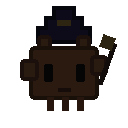
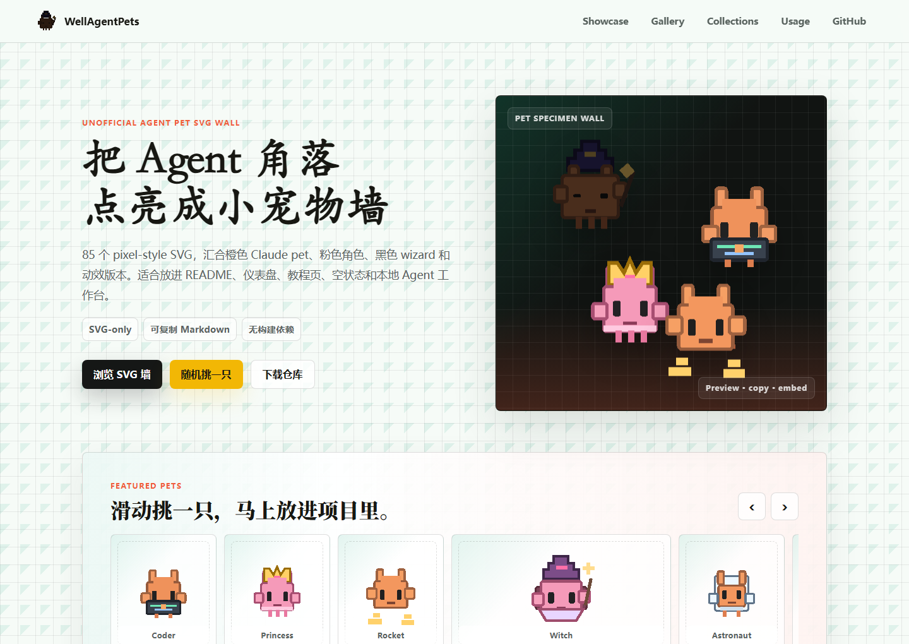
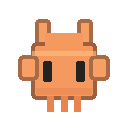
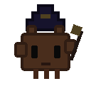
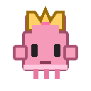
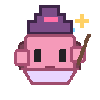

<div align="center">
  
  <h1>WellAgentPets</h1>
  <p><strong>一个专门收藏 Claude / Agent 小宠物 SVG 的轻量仓库。</strong></p>
  <p>
    <a href="https://harzva.github.io/WellAgentPets/">Live Gallery</a>
    ·
    <a href="#-svg-collections">Collections</a>
    ·
    <a href="#-usage">Usage</a>
    ·
    <a href="NOTICE.md">Notice</a>
  </p>
  <p>
    
    
    
    
  </p>
</div>

<p align="center">
  
</p>

## What Is This

WellAgentPets 是一个面向 README、教程页、仪表盘、状态卡片和本地 Agent 工作台的 SVG 小宠物素材库。仓库把原来的橙色 Claude pets、粉色角色、动效 SVG，以及黑色主题 wizard 压缩包整理成统一目录，并提供一个可搜索、可筛选、可预览、可复制路径和 Markdown 的 GitHub Pages 展示页。

> This is an unofficial fan-made SVG collection. It is not affiliated with Anthropic or Claude.

## SVG Collections

| Collection | Path | Count | Best for |
| --- | --- | ---: | --- |
| Dark Wizard | `pets/dark/wizard/` | 20 | Dark-mode docs, terminal panels, magical agent states |
| Orange Static | `pets/orange/static/` | 27 | README sections, empty states, feature cards |
| Orange Animated | `pets/orange/animated/` | 8 | Loading states, celebration moments, live demos |
| Pink Static | `pets/pink/static/` | 10 | Friendly tutorials, profile pages, softer UI states |
| Pink Animated | `pets/pink/animated/` | 20 | Playful onboarding, motion-rich docs, agent mascots |

<p align="center">
  
  
  
  
  
  
</p>

## Live Gallery

Open the GitHub Pages wall:

**https://harzva.github.io/WellAgentPets/**

The page reads `data/pets.json`, renders all 85 SVGs, and supports quick filtering by Orange, Dark, Pink, and Animated collections.

## Gallery Features

| Feature | Detail |
| --- | --- |
| Search and filters | Filter by keyword, color family, dark wizard, or animated SVGs |
| Detail preview | Open any pet in a larger preview dialog before copying |
| Copy-ready snippets | Copy a raw path from cards, or copy Markdown from the detail dialog |
| Random picker | Pick a pet instantly from the hero or gallery toolbar |
| Keyboard search | Press `/` on the gallery page to focus search |
| Static hosting | No build step, no framework runtime, ready for GitHub Pages |

## Usage

Markdown:

```md

```

HTML:

```html

```

CSS:

```css
img.agent-pet {
  image-rendering: pixelated;
}
```

Remote raw URL pattern:

```txt
https://raw.githubusercontent.com/Harzva/WellAgentPets/main/pets/orange/static/claude-pet-coder.svg
```

## Project Structure

```txt
WellAgentPets/
├─ assets/
│  ├─ app.js
│  └─ styles.css
├─ data/
│  └─ pets.json
├─ docs/
│  └─ wellagentpets-preview.png
├─ pets/
│  ├─ dark/wizard/
│  ├─ orange/static/
│  ├─ orange/animated/
│  ├─ pink/static/
│  └─ pink/animated/
├─ index.html
├─ NOTICE.md
└─ README.md
```

## Maintenance Notes

- Keep new files as standalone SVGs under `pets/<series>/<group>/`.
- Update `data/pets.json` after adding or renaming assets.
- Keep the public page dependency-free so GitHub Pages can serve it as static files.
- Do not place private tokens, source archives, or temporary extraction folders in the repo.

## License And Notice

Repository code and organization are released under the MIT License. The SVG collection is provided as an unofficial fan-made asset set. This repository does not grant trademark rights and is not affiliated with Anthropic or Claude. See [NOTICE.md](NOTICE.md).
